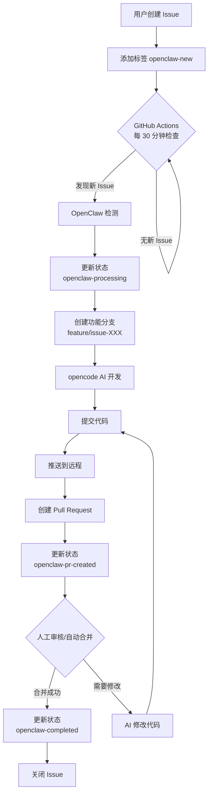

# OpenClaw 全自动开发示例项目 - 设计方案

> ⚠️ **已过时** - 本文档描述的是旧版单体流程。
> **当前系统请参考**：[MULTI_AGENT_DESIGN.md](./MULTI_AGENT_DESIGN.md)（四 Agent 协作流程）

> 📋 **版本**: v1.0（已归档）
> 📅 **日期**: 2026-03-17

---

## 📖 目录

1. [项目概述](#1-项目概述)
2. [工作流程设计](#2-工作流程设计)
3. [系统架构](#3-系统架构)
4. [Issue 状态机设计](#4-issue-状态机设计)
5. [核心组件设计](#5-核心组件设计)
6. [定时任务设计](#6-定时任务设计)
7. [安全与限制](#7-安全与限制)
8. [项目结构](#8-项目结构)
9. [配置清单](#9-配置清单)
10. [实施步骤](#10-实施步骤)
11. [测试方案](#11-测试方案)
12. [扩展方向](#12-扩展方向)

---

## 1. 项目概述

### 1.1 项目目标

构建一个由 OpenClaw 驱动的全自动软件开发系统，实现：

```
Issue 创建 → 自动检测 → 分支开发 → PR 提交 → 自动合并 → 状态更新
```

### 1.2 核心特性

| 特性 | 说明 |
|------|------|
| **自动检测** | 每 30 分钟扫描新 Issue |
| **单线程处理** | 同时只处理一个 Issue，避免冲突 |
| **状态追踪** | Issue 全生命周期状态管理 |
| **自动开发** | 使用 opencode AI 进行代码实现 |
| **自动 PR** | 开发完成后自动创建 Pull Request |
| **状态同步** | PR 合并后自动更新 Issue 状态 |

### 1.3 适用场景

- ✅ 小型功能开发
- ✅ Bug 修复
- ✅ 文档更新
- ✅ 简单重构
- ⚠️ 复杂架构设计（需人工介入）
- ⚠️ 敏感安全修复（需人工审核）

---

## 2. 工作流程设计

### 2.1 完整流程图



### 2.2 角色职责

| 角色 | 职责 |
|------|------|
| **用户** | 创建 Issue，描述需求，添加 `openclaw-new` 标签 |
| **GitHub Actions** | 定时触发器，每 30 分钟检查新 Issue |
| **OpenClaw Agent** | 核心智能体，协调整个流程 |
| **opencode AI** | 代码生成与实现 |
| **人工审核者** | 审核 PR，决定是否合并（可配置自动合并） |

### 2.3 时间线示例

```
T+0min    用户创建 Issue #42，添加标签 openclaw-new
  ↓
T+0~30min GitHub Actions 检测到新 Issue
  ↓
T+1min    OpenClaw 更新状态为 openclaw-processing
  ↓
T+2min    创建分支 feature/issue-42
  ↓
T+3~15min opencode AI 开发实现
  ↓
T+16min   提交代码并推送
  ↓
T+17min   创建 Pull Request #43
  ↓
T+18min   更新 Issue 状态为 openclaw-pr-created
  ↓
T+18~60min 人工审核 PR（或自动合并）
  ↓
T+61min   PR 合并，更新状态为 openclaw-completed
  ↓
T+62min   关闭 Issue #42
```

---

## 3. 系统架构

### 3.1 架构图

```
┌────────────────────────────────────────────────────────────────┐
│                       GitHub Repository                         │
├────────────────────────────────────────────────────────────────┤
│                                                                 │
│  ┌──────────────┐  ┌──────────────┐  ┌──────────────┐         │
│  │    Issues    │  │   Branches   │  │  Pull Requests│         │
│  │  (状态管理)   │  │  (功能开发)   │  │   (代码审核)   │          │
│  └──────┬───────┘  └──────┬───────┘  └──────┬───────┘         │
│         │                  │                  │                 │
│         └──────────────────┼──────────────────┘                 │
│                            │                                    │
│              ┌─────────────▼──────────────┐                    │
│              │      GitHub Actions        │                    │
│              │   (定时触发器 + 事件响应)    │                    │
│              └─────────────┬──────────────┘                    │
│                            │                                    │
└────────────────────────────┼────────────────────────────────────┘
                             │ Webhook / Polling
                             │
                    ┌────────▼────────┐
                    │   OpenClaw      │
                    │    Agent        │
                    │                 │
                    │  ┌───────────┐  │
                    │  │ HEARTBEAT │  │
                    │  │  (30min)  │  │
                    │  └───────────┘  │
                    │  ┌───────────┐  │
                    │  │  gh CLI   │  │
                    │  └───────────┘  │
                    │  ┌───────────┐  │
                    │  │ opencode  │  │
                    │  └───────────┘  │
                    └─────────────────┘
```

### 3.2 技术栈

| 组件 | 技术选型 | 说明 |
|------|----------|------|
| **自动化框架** | OpenClaw | AI 智能体编排 |
| **代码生成** | opencode AI | AI 驱动的代码实现 |
| **GitHub 集成** | GitHub CLI (gh) | Issue/PR/Branch 管理 |
| **定时任务** | GitHub Actions | 每 30 分钟触发 |
| **状态管理** | GitHub Labels | Issue 状态标签 |
| **工作流引擎** | GitHub Actions | 事件驱动自动化 |

---

## 4. Issue 状态机设计

### 4.1 状态定义

| 状态标签 | 含义 | 触发条件 | 允许的操作 |
|----------|------|----------|------------|
| `openclaw-new` | 新 Issue，等待处理 | 用户创建时手动添加 | → processing |
| `openclaw-processing` | OpenClaw 正在处理 | 自动更新 | → pr-created / error |
| `openclaw-pr-created` | PR 已创建，等待审核 | PR 创建后自动更新 | → completed / processing |
| `openclaw-completed` | 已完成合并 | PR 合并后自动更新 | (终态) |
| `openclaw-error` | 处理失败 | 异常时手动/自动添加 | → new / processing |

### 4.2 状态转换图

```mermaid
stateDiagram-v2
    [*] --> openclaw-new: 用户创建 Issue
    openclaw-new --> openclaw-processing: OpenClaw 检测
    openclaw-processing --> openclaw-pr-created: PR 创建完成
    openclaw-processing --> openclaw-error: 处理失败
    openclaw-pr-created --> openclaw-completed: PR 合并
    openclaw-pr-created --> openclaw-processing: 需要修改
    openclaw-error --> openclaw-new: 人工重试
    openclaw-error --> openclaw-processing: 人工修复后重试
    openclaw-completed --> [*]: Issue 关闭
```

### 4.3 状态变更日志

每次状态变更时，自动添加评论记录：

```markdown
🤖 **OpenClaw 状态更新**

- **时间**: 2026-03-17 23:45:00 UTC+8
- **操作**: 状态变更
- **从**: `openclaw-new`
- **到**: `openclaw-processing`
- **执行者**: @openclaw-bot
- **备注**: 开始处理此 Issue，预计 30 分钟内完成
```

---

## 5. 核心组件设计

### 5.1 OpenClaw 心跳模块

**文件**: `HEARTBEAT.md`

**功能**:
- 每 30 分钟触发一次检查
- 查询 `openclaw-new` 状态的 Issue
- 如果存在，获取第一个 Issue 编号
- 调用处理脚本

**伪代码**:
```bash
# 检查是否有正在处理的 Issue
processing=$(gh issue list --state open --label "openclaw-processing" --limit 1)

if [ -n "$processing" ]; then
    echo "已有 Issue 在处理中，跳过"
    exit 0
fi

# 查询新 Issue
new_issues=$(gh issue list --state open --label "openclaw-new" --limit 1)

if [ -z "$new_issues" ]; then
    echo "无新 Issue"
    exit 0
fi

# 获取 Issue 编号
issue_number=$(echo "$new_issues" | jq -r '.[0].number')

# 调用处理脚本
./scripts/process-issue.sh $issue_number
```

### 5.2 Issue 处理脚本

**文件**: `scripts/process-issue.sh`

**输入**: Issue 编号

**输出**: PR URL

**步骤**:
1. 更新 Issue 状态为 `openclaw-processing`
2. 获取 Issue 标题和描述
3. 创建功能分支 `feature/issue-<number>`
4. 使用 opencode 进行开发
5. 提交代码
6. 推送到远程
7. 创建 Pull Request
8. 更新 Issue 状态为 `openclaw-pr-created`
9. 记录日志

### 5.3 PR 合并处理器

**文件**: `.github/workflows/pr-merge.yml`

**触发条件**: Pull Request closed 事件（且 merged=true）

**功能**:
1. 从 PR 分支名提取 Issue 编号
2. 更新 Issue 状态为 `openclaw-completed`
3. 移除 `openclaw-processing` 标签
4. 添加完成评论

### 5.4 opencode 集成

**命令示例**:
```bash
# 启动 opencode 会话
opencode run "实现 Issue #42: 添加用户登录功能"

# 使用 Plan 模式（先设计后实现）
opencode agent plan "设计用户登录功能架构"
opencode agent build "实现登录功能"
```

**Prompt 模板**:
```
请实现以下 GitHub Issue 的需求：

Issue #${ISSUE_NUMBER}: ${ISSUE_TITLE}

需求描述：
${ISSUE_BODY}

要求：
1. 遵循项目现有代码风格
2. 添加必要的单元测试
3. 更新相关文档
4. 确保代码可编译/可运行

请在当前分支中实现以上功能。
```

---

## 6. 定时任务设计

### 6.1 GitHub Actions 定时触发器

**文件**: `.github/workflows/issue-check.yml`

```yaml
name: Issue Check

on:
  schedule:
    # 每 30 分钟执行一次（每小时的 0 分和 30 分）
    - cron: '0,30 * * * *'
  workflow_dispatch:  # 允许手动触发

jobs:
  check-issues:
    runs-on: ubuntu-latest
    steps:
      - uses: actions/checkout@v4
      
      - name: Check for new issues
        env:
          GH_TOKEN: ${{ secrets.GH_TOKEN }}
        run: |
          # 检查是否有正在处理的 Issue
          processing=$(gh issue list --state open \
            --label "openclaw-processing" --limit 1)
          
          if [ -n "$processing" ]; then
            echo "已有 Issue 在处理中"
            exit 0
          fi
          
          # 查询新 Issue
          new_issues=$(gh issue list --state open \
            --label "openclaw-new" --limit 1)
          
          if [ -z "$new_issues" ]; then
            echo "无新 Issue"
            exit 0
          fi
          
          # 触发 OpenClaw 处理
          issue_number=$(echo "$new_issues" | jq -r '.[0].number')
          # 通过 Webhook 或 API 通知 OpenClaw
          curl -X POST "${{ secrets.OPENCLAW_WEBHOOK_URL }}" \
            -H "Content-Type: application/json" \
            -d "{\"issue_number\": $issue_number}"
```

### 6.2 时间配置选项

| 频率 | Cron 表达式 | 适用场景 |
|------|------------|----------|
| 每 10 分钟 | `*/10 * * * *` | 高频项目，快速响应 |
| 每 30 分钟 | `0,30 * * * *` | **默认推荐**，平衡响应速度和资源 |
| 每小时 | `0 * * * *` | 低频项目，节省资源 |
| 工作日工作时间 | `0 9-18 * * 1-5` | 仅工作日处理 |

---

## 7. 安全与限制

### 7.1 并发控制

**规则**: 同时只处理一个 Issue

**实现**:
```bash
# 检查是否有正在处理的 Issue
processing=$(gh issue list --state open \
  --label "openclaw-processing" --limit 1)

if [ -n "$processing" ]; then
    echo "已有 Issue 在处理中，跳过本次检查"
    exit 0
fi
```

**原因**:
- 避免分支冲突
- 便于问题追踪
- 降低 AI 出错影响范围

### 7.2 权限控制

| 操作 | 所需权限 | 说明 |
|------|----------|------|
| 读取 Issue | `repo:public_repo` | 公开仓库默认支持 |
| 更新 Issue 标签 | `repo` | 需要写权限 |
| 创建分支 | `repo` | 需要写权限 |
| 创建 PR | `repo` | 需要写权限 |
| 合并 PR | `repo` + 分支保护 | 可能需要管理员权限 |

### 7.3 敏感操作保护

**禁止自动执行的操作**:
- ❌ 删除文件（除非 Issue 明确要求）
- ❌ 修改 CI/CD 配置
- ❌ 修改权限相关文件
- ❌ 添加/修改 Secrets
- ❌ 合并到保护分支（需人工审核）

**建议配置**:
```yaml
# 分支保护规则
main 分支:
  - 要求 PR 审核（至少 1 人）
  - 要求状态检查通过
  - 禁止强制推送
  - 禁止自动合并（除非测试通过）
```

### 7.4 错误处理

**错误类型及处理**:

| 错误类型 | 处理方式 |
|----------|----------|
| opencode 开发失败 | 添加 `openclaw-error` 标签，记录错误日志 |
| Git 推送失败 | 重试 3 次，失败后标记错误 |
| PR 创建失败 | 检查分支冲突，标记错误 |
| API 限流 | 等待 1 小时后重试 |

**错误日志格式**:
```markdown
🚨 **OpenClaw 处理错误**

- **时间**: 2026-03-17 23:45:00 UTC+8
- **Issue**: #42
- **错误类型**: opencode 超时
- **错误信息**: 代码生成超时（>15 分钟）
- **建议操作**: 人工介入或重试
```

---

## 8. 项目结构

```
openclaw-auto-dev/
│
├── .github/
│   └── workflows/
│       ├── issue-check.yml      # Issue 检查定时任务（每 30 分钟）
│       ├── pr-merge.yml         # PR 合并后处理器
│       └── auto-merge.yml       # 自动合并配置（可选）
│
├── scripts/
│   ├── process-issue.sh         # Issue 处理主脚本
│   ├── update-status.sh         # 状态更新工具脚本
│   └── check-conflicts.sh       # 分支冲突检查脚本
│
├── src/
│   └── ...                      # 项目源代码
│
├── tests/
│   └── ...                      # 测试代码
│
├── docs/
│   ├── workflow.md              # 工作流详细说明
│   ├── setup.md                 # 部署指南
│   └── troubleshooting.md       # 故障排除手册
│
├── logs/
│   └── .gitkeep                 # 处理日志目录
│
├── .gitignore                   # Git 忽略配置
├── HEARTBEAT.md                 # OpenClaw 心跳配置
├── README.md                    # 项目说明
└── DESIGN.md                    # 本设计文档
```

---

## 9. 配置清单

### 9.1 GitHub Secrets

| 名称 | 说明 | 是否必需 |
|------|------|----------|
| `GH_TOKEN` | GitHub Personal Access Token | ✅ 必需 |
| `OPENCLAW_WEBHOOK_URL` | OpenClaw 消息推送地址 | ⚠️ 推荐 |
| `OPENCLAW_API_KEY` | OpenClaw API 密钥（如使用 API） | ⚠️ 可选 |

### 9.2 GitHub Token 权限

生成 Token 时勾选以下权限：

- ✅ `repo` (完全控制私有仓库)
- ✅ `workflow` (管理 GitHub Actions)
- ✅ `write:packages` (如使用 Packages)

### 9.3 OpenClaw 配置

**文件**: `HEARTBEAT.md`

```markdown
# OpenClaw Auto Dev 配置

## 任务频率
- 每 30 分钟检查一次 Issue

## 并发控制
- 同时只处理一个 Issue

## 状态标签
- openclaw-new → openclaw-processing → openclaw-pr-created → openclaw-completed

## 错误处理
- 失败时添加 openclaw-error 标签
- 记录错误日志到 logs/ 目录
```

### 9.4 opencode 配置

**文件**: `~/.opencode/config.json` (如需要)

```json
{
  "model": "claude-sonnet-4-5-20250929",
  "max_tokens": 4096,
  "timeout": 900
}
```

---

## 10. 实施步骤

### 阶段 1: 准备工作

| 步骤 | 操作 | 预计时间 |
|------|------|----------|
| 1.1 | 创建 GitHub 仓库 | 5 分钟 |
| 1.2 | 克隆仓库到本地 | 2 分钟 |
| 1.3 | 创建项目结构 | 10 分钟 |
| 1.4 | 编写脚本文件 | 30 分钟 |
| 1.5 | 编写工作流文件 | 20 分钟 |

### 阶段 2: 配置

| 步骤 | 操作 | 预计时间 |
|------|------|----------|
| 2.1 | 生成 GitHub Token | 5 分钟 |
| 2.2 | 配置 GitHub Secrets | 5 分钟 |
| 2.3 | 启用 GitHub Actions | 2 分钟 |
| 2.4 | 配置 OpenClaw 心跳 | 10 分钟 |
| 2.5 | 配置 opencode | 10 分钟 |

### 阶段 3: 测试

| 步骤 | 操作 | 预计时间 |
|------|------|----------|
| 3.1 | 创建测试 Issue | 2 分钟 |
| 3.2 | 手动触发工作流 | 5 分钟 |
| 3.3 | 验证 Issue 状态变更 | 5 分钟 |
| 3.4 | 验证 PR 创建 | 10 分钟 |
| 3.5 | 验证 PR 合并后状态 | 5 分钟 |

### 阶段 4: 优化

| 步骤 | 操作 | 预计时间 |
|------|------|----------|
| 4.1 | 调整心跳频率 | 5 分钟 |
| 4.2 | 配置自动合并规则 | 10 分钟 |
| 4.3 | 添加通知集成 | 20 分钟 |
| 4.4 | 编写文档 | 30 分钟 |

**总预计时间**: 约 3-4 小时

---

## 11. 测试方案

### 11.1 测试用例

| 用例 ID | 测试场景 | 预期结果 |
|---------|----------|----------|
| TC-01 | 创建 `openclaw-new` Issue | 30 分钟内状态变为 `processing` |
| TC-02 | 同时创建 2 个 `openclaw-new` Issue | 只处理第一个，第二个等待 |
| TC-03 | Issue 处理成功 | PR 创建，状态变为 `pr-created` |
| TC-04 | PR 合并 | Issue 状态变为 `completed` |
| TC-05 | opencode 开发失败 | Issue 状态变为 `error`，记录日志 |
| TC-06 | 分支冲突 | 重试或标记错误 |
| TC-07 | 手动触发工作流 | 立即执行检查 |
| TC-08 | API 限流 | 等待后重试，不崩溃 |

### 11.2 测试 Issue 模板

```markdown
---
title: "[Test] 测试自动开发流程"
labels: ["openclaw-new", "test"]
---

## 测试目的

验证 OpenClaw 全自动开发工作流是否正常工作。

## 预期行为

1. OpenClaw 在 30 分钟内检测到本 Issue
2. 状态更新为 `openclaw-processing`
3. 创建功能分支并开发
4. 创建 Pull Request
5. 状态更新为 `openclaw-pr-created`
6. PR 合并后状态更新为 `openclaw-completed`

## 验收标准

- [ ] Issue 状态正确流转
- [ ] PR 成功创建
- [ ] 代码符合基本规范
- [ ] 日志记录完整
```

### 11.3 测试检查清单

```bash
# 1. 检查 Issue 状态
gh issue list --label "openclaw-new"
gh issue list --label "openclaw-processing"
gh issue list --label "openclaw-pr-created"
gh issue list --label "openclaw-completed"

# 2. 检查分支
git branch -a | grep "feature/issue-"

# 3. 检查 PR
gh pr list --state open
gh pr list --state merged

# 4. 检查 Actions 日志
gh run list --limit 5
gh run view <run_id> --log

# 5. 检查 OpenClaw 会话
openclaw sessions list
```

---

## 12. 扩展方向

### 12.1 功能扩展

| 扩展 | 说明 | 难度 |
|------|------|------|
| **多 Issue 并行** | 同时处理 N 个 Issue | ⭐⭐⭐ |
| **优先级队列** | 根据 Issue 优先级排序 | ⭐⭐ |
| **自动测试** | PR 创建后自动运行测试 | ⭐⭐ |
| **代码审查 AI** | 自动 Code Review | ⭐⭐⭐ |
| **自动部署** | 合并后自动部署 | ⭐⭐⭐ |
| **通知集成** | 钉钉/Slack/邮件通知 | ⭐ |

### 12.2 多仓库支持

```bash
# 配置文件支持多仓库
repositories:
  - name: repo-a
    branch: main
    labels: ["openclaw-new"]
  - name: repo-b
    branch: master
    labels: ["auto-dev"]
```

### 12.3 自定义 AI 模型

```yaml
# 根据不同任务类型选择模型
model_routing:
  feature: "claude-sonnet-4-5-20250929"
  bugfix: "claude-haiku-3-5"
  docs: "gpt-4o-mini"
  refactor: "claude-sonnet-4-5-20250929"
```

### 12.4 数据分析

```python
# 统计 OpenClaw 处理效率
{
  "total_issues": 100,
  "completed": 85,
  "failed": 5,
  "avg_processing_time": "25min",
  "success_rate": "94.4%"
}
```

---

## 📎 附录

### A. GitHub CLI 命令速查

```bash
# Issue 操作
gh issue list                          # 列出 Issue
gh issue view <number>                 # 查看 Issue 详情
gh issue create --title "..." --body "..."  # 创建 Issue
gh issue edit <number> --add-label "..."    # 添加标签
gh issue comment <number> --body "..."      # 添加评论

# PR 操作
gh pr list                             # 列出 PR
gh pr create --title "..." --body "..." --head "..." --base "..."
gh pr merge <number> --merge           # 合并 PR
gh pr checkout <number>                # 切换到 PR 分支

# 仓库操作
gh repo create <name> --public --description "..."
git clone <url>
git push -u origin <branch>
```

### B. Cron 表达式速查

| 表达式 | 含义 |
|--------|------|
| `0,30 * * * *` | 每 30 分钟（0 分和 30 分） |
| `*/10 * * * *` | 每 10 分钟 |
| `0 * * * *` | 每小时 |
| `0 9-18 * * 1-5` | 工作日 9:00-18:00 每小时 |
| `0 0 * * *` | 每天午夜 |

### C. 常见问题

**Q: Issue 没有被自动处理？**
- 检查 GitHub Actions 是否启用
- 检查 `GH_TOKEN` Secret 是否正确
- 检查 Issue 是否有 `openclaw-new` 标签
- 查看 Actions 日志

**Q: PR 创建失败？**
- 检查分支是否已推送
- 检查 Token 权限是否足够
- 查看是否有同名分支冲突

**Q: opencode 无响应？**
- 检查 opencode 是否安装
- 检查 API 配额是否用完
- 查看 opencode 日志

---

**设计文档版本**: v1.0  
**最后更新**: 2026-03-17  
**维护者**: OpenClaw Team
